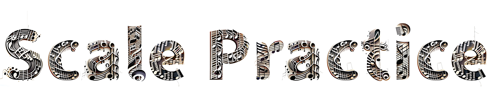

A react app to help musicians practice scales. 
## Features
- AMEB Grades
- Custom Grade Picker
- Intuitive UI
- Random scales or in order
- Type Scale Challenge to help the user memorise scales
# Dependencies
- [@tonaljs/scale](https://www.npmjs.com/package/@tonaljs/scale)
- [antd](https://www.npmjs.com/package/antd)
- [react](https://www.npmjs.com/package/react)
- [react-dom](https://www.npmjs.com/package/react-dom)

## Build
- Install nodejs and npm
- Clone the repository
- Install dependencies
- Build with `npm run build`

## Licence
See [LICENSE](LICENSE) for the license.